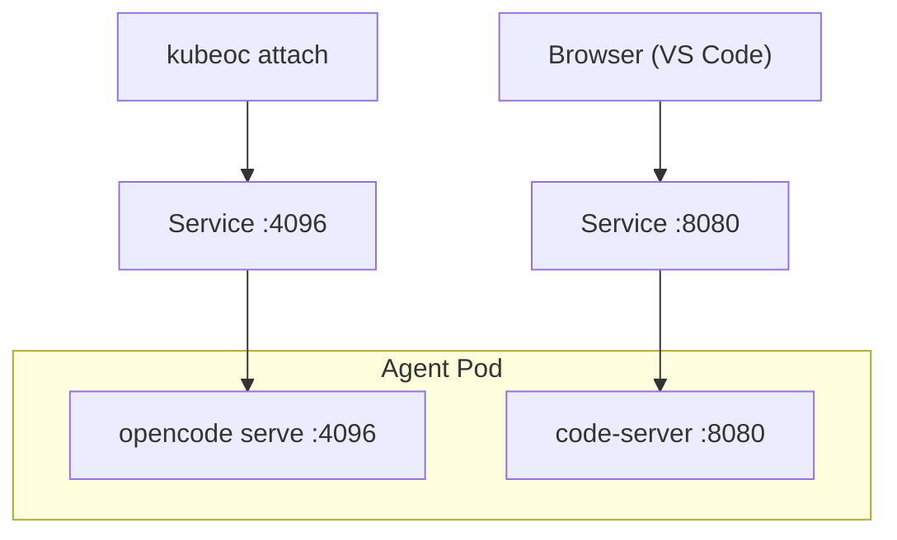

# VS Code in Browser

Run a full VS Code editor alongside your AI agent, accessible from any browser. This enables a powerful workflow where you can observe and interact with the agent's workspace in real-time — watching file changes, inspecting code, and making manual edits while the agent works.

## Overview

[code-server](https://github.com/coder/code-server) by Coder runs VS Code as a web application inside a container. Combined with KubeOpenCode's [extraPorts](../features/pod-configuration.md#extra-ports) feature, you can expose the VS Code UI through the Agent's Service and access it via `kubectl port-forward` or Ingress.



## Custom Executor Image

Create an executor image that extends devbox with code-server:

```dockerfile
FROM ghcr.io/kubeopencode/kubeopencode-agent-devbox:latest

USER root

# Install code-server
RUN curl -fsSL https://code-server.dev/install.sh | sh

# Create startup script
RUN cat > /usr/local/bin/start-code-server.sh << 'EOF'
#!/bin/bash
# Start code-server in background if not already running
if ! pgrep -x code-server > /dev/null 2>&1; then
    code-server \
        --bind-addr 0.0.0.0:8080 \
        --auth none \
        --disable-telemetry \
        --user-data-dir /tmp/.vscode-server \
        /workspace &>/tmp/code-server.log &
    echo "code-server started on :8080" >&2
fi
EOF
RUN chmod +x /usr/local/bin/start-code-server.sh

# Auto-start code-server when interactive shells open.
# This covers shell subprocesses spawned by OpenCode tools.
RUN echo '/usr/local/bin/start-code-server.sh' >> /etc/bash.bashrc && \
    echo '/usr/local/bin/start-code-server.sh' >> /etc/zsh/zshrc

USER 1000:0
WORKDIR /workspace
CMD ["/bin/zsh"]
```

> **Important**: KubeOpenCode overrides the container's `ENTRYPOINT` with `sh -c "/tools/opencode serve ..."`, which is a non-interactive shell that does not read `bashrc`/`zshrc`. This means code-server starts when OpenCode first spawns an interactive shell subprocess (e.g., during the first Task), not immediately at Pod startup.
>
> To start code-server immediately after the Pod is ready:
> ```bash
> kubectl exec deployment/<agent-name>-server -n <namespace> -- /usr/local/bin/start-code-server.sh
> ```

Build and push:

```bash
docker build -t your-registry/devbox-vscode:latest .
docker push your-registry/devbox-vscode:latest
```

> **Note**: The `--auth none` flag disables password authentication. This is acceptable when access is restricted through Kubernetes RBAC and network policies. For environments where the Service is exposed externally, use `--auth password` with the `PASSWORD` environment variable set via a [credential](../features/agent-configuration.md).

## Agent Configuration

```yaml
apiVersion: kubeopencode.io/v1alpha1
kind: Agent
metadata:
  name: dev-agent
spec:
  profile: "Development agent with VS Code in browser"
  agentImage: ghcr.io/kubeopencode/kubeopencode-agent-opencode:latest
  executorImage: your-registry/devbox-vscode:latest
  workspaceDir: /workspace
  serviceAccountName: kubeopencode-agent
  port: 4096
  extraPorts:
    - name: vscode
      port: 8080
```

## Accessing VS Code

Once the Agent is running:

```bash
# Port-forward the VS Code port
kubectl port-forward svc/dev-agent 8080:8080 -n <namespace>

# Open in browser
open http://localhost:8080
```

You can also port-forward both the OpenCode server and VS Code simultaneously:

```bash
# Both ports at once
kubectl port-forward svc/dev-agent 4096:4096 8080:8080 -n <namespace>
```

## Workflow

1. **Create an Agent** with the custom executor image and `extraPorts`
2. **Open VS Code** in your browser via port-forward
3. **Create a Task** — the AI agent starts working in the same workspace
4. **Watch in real-time** — VS Code shows file changes as the agent edits them
5. **Collaborate** — make manual edits in VS Code while the agent works, or use the terminal in VS Code to run commands

## Combining with Docker-in-Docker

For the full development experience (VS Code + Docker), combine this with the [DinD setup](docker-in-docker.md):

```dockerfile
FROM ghcr.io/kubeopencode/kubeopencode-agent-devbox:latest

USER root

# Install Docker daemon (for DinD)
RUN apt-get update && apt-get install -y --no-install-recommends \
    docker-ce \
    containerd.io \
    && rm -rf /var/lib/apt/lists/*

# Install code-server
RUN curl -fsSL https://code-server.dev/install.sh | sh

# Docker lazy-init wrapper (see DinD docs)
RUN mv /usr/bin/docker /usr/bin/docker.real
COPY --chmod=755 docker-lazy-init.sh /usr/bin/docker

# code-server auto-start
COPY --chmod=755 start-code-server.sh /usr/local/bin/
RUN echo '/usr/local/bin/start-code-server.sh' >> /etc/bash.bashrc && \
    echo '/usr/local/bin/start-code-server.sh' >> /etc/zsh/zshrc

USER 0:0  # Root for Sysbox DinD
WORKDIR /workspace
CMD ["/bin/zsh"]
```

```yaml
apiVersion: kubeopencode.io/v1alpha1
kind: Agent
metadata:
  name: full-dev-agent
spec:
  profile: "Full dev environment with VS Code + Docker"
  executorImage: your-registry/devbox-full:latest
  workspaceDir: /workspace
  serviceAccountName: kubeopencode-agent
  extraPorts:
    - name: vscode
      port: 8080
    - name: webapp
      port: 3000
  podSpec:
    runtimeClassName: sysbox-runc
```

## Tips

### Persistent Extensions

VS Code extensions are installed to `--user-data-dir`. To persist them across Pod restarts, use [workspace persistence](../features/persistence.md):

```yaml
spec:
  persistence:
    workspace:
      size: "10Gi"
```

### Pre-installing Extensions

Add extensions to the Dockerfile for a ready-to-use environment:

```dockerfile
# Install extensions at build time
RUN code-server --install-extension ms-python.python \
    && code-server --install-extension golang.go \
    && code-server --install-extension esbenp.prettier-vscode
```

### Security Considerations

- `--auth none` is only safe when access is controlled at the Kubernetes level (RBAC, NetworkPolicy)
- For shared clusters, use `--auth password` with the `PASSWORD` environment variable injected via Agent credentials
- Consider adding a NetworkPolicy to restrict who can access the VS Code port
